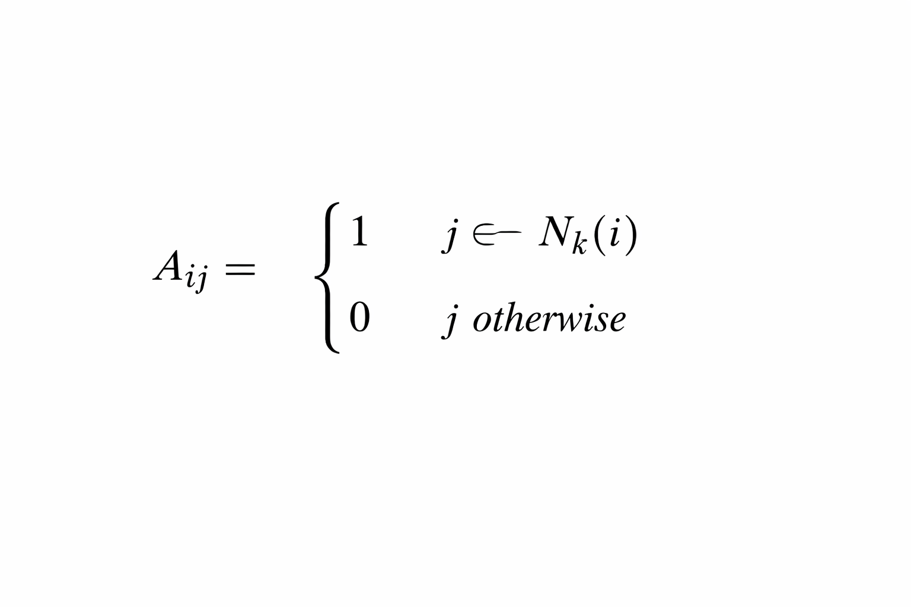

# kNN 대칭화와 Similarity 행렬 설계 개념 정리

## 1. 문제 상황

kNN을 사용하면 각 데이터 i에 대해 k개의 이웃 집합 (N_k(i))가 생성된다.
이를 행렬로 표현하면



이 행렬은 **방향 그래프(adjacency)** 이다.
즉 일반적으로

[
A_{ij} \ne A_{ji}
]

---

## 2. 왜 대칭화가 필요한가

QUBO 목적함수는 반드시

[
Q_{ij} = Q_{ji}
]

를 만족해야 한다.
즉 **유사도 행렬은 반드시 대칭 행렬이어야 한다.**

하지만 kNN 결과는 방향성을 가지므로 그대로 사용할 수 없다.

---

## 3. 해결 방법 — OR 대칭화

우리는 다음 조건을 사용한다.

[
A^{sym}_{ij} =
\begin{cases}
1 & (j \in N_k(i)) \text{ OR } (i \in N_k(j)) \
0 & \text{otherwise}
\end{cases}
]

코드 구현:

```python
A_sym = np.maximum(A, A.T)
```

이 연산은 원소별로

[
\max(A_{ij}, A_{ji})
]

를 취한다.

---

## 4. 왜 mutual kNN(AND)을 쓰지 않는가

mutual 방식:

[
A_{ij}=1 \text{ only if } i \in N_k(j) \text{ AND } j \in N_k(i)
]

문제점:

* 그래프가 너무 sparse해짐
* 실제로 유사한 데이터도 연결되지 않음
* redundancy 탐지 실패 가능

---

## 5. OR 방식이 더 적합한 이유

subset selection의 목적은

> “서로 이웃인가?”가 아니라
> “둘이 충분히 비슷한가?”이다.

즉 필요한 조건은

> 가까움이 한 번이라도 관측되었는가

이지

> 서로 동시에 가까운가

가 아니다.

---

## 6. 직관적 해석

kNN은 순위 기반이라 방향성이 존재한다.
하지만 similarity는 거리 기반이므로 본질적으로 방향성이 없다.

따라서 우리는

* 순위 정보 → proximity signal로만 사용
* 방향 정보 → 제거

한다.

---

## 7. 최종 Similarity 행렬 정의

최종 유사도 행렬:

[
R_{ij} =
\begin{cases}
\text{cosine}(x_i,x_j) & \text{if } A^{sym}_{ij}=1 \
0 & \text{otherwise}
\end{cases}
]

즉

> kNN 그래프로 연결된 쌍만 similarity 계산

---

## 8. 핵심 요약

* kNN 결과는 방향 그래프다
* QUBO는 대칭 행렬이 필요하다
* 따라서 adjacency를 대칭화해야 한다
* OR 방식이 subset selection에 가장 적합하다

---

## 최종 한 문장 정의

> kNN 결과는 proximity 신호로만 사용하고, 방향성은 제거하여 대칭 similarity 행렬을 구성한다.

# kNN 대칭화에서 전치행렬을 사용하는 이유

## 1. kNN adjacency 행렬의 의미

kNN으로 생성한 행렬 A는 다음 의미를 가진다:

A_ij = 1 if j ∈ Nk(i)

즉,

-   행 i = 기준 데이터
-   열 j = 이웃 후보

따라서 A는 **i 기준 이웃 관계만 기록된 방향 그래프**이다.

일반적으로

A_ij ≠ A_ji

가 성립한다.

이유는 kNN이 거리 순위 기반 선택이기 때문이다.

------------------------------------------------------------------------

## 2. 전치행렬의 의미

전치행렬은 단순히 인덱스를 뒤집는 연산이다:

(Aᵀ)\_ij = A_ji

따라서

-   A → i 기준 이웃 관계
-   Aᵀ → j 기준 이웃 관계

를 담고 있다.

즉 전치행렬은 새로운 계산 결과가 아니라

> 기존 kNN 결과를 반대 관점에서 본 것

이다.

------------------------------------------------------------------------

## 3. 전치행렬을 합치는 이유

우리가 실제로 알고 싶은 것은

> 둘 중 하나라도 가까운 관계였는가

이지

> 서로 동시에 가까운가

가 아니다.

그래서 adjacency를 다음과 같이 정의한다:

A_sym_ij = max(A_ij, A_ji)

코드 구현:

``` python
A_sym = np.maximum(A, A.T)
```

이는 의미적으로

i \~ j if (i→j) OR (j→i)

를 뜻한다.

------------------------------------------------------------------------

## 4. 왜 mutual kNN(AND)을 쓰지 않는가

mutual 조건:

A_ij = 1 only if (i→j) AND (j→i)

문제점:

-   그래프가 지나치게 sparse해짐
-   실제 유사 데이터 연결이 끊어짐
-   redundancy 탐지 실패 가능

즉 너무 엄격한 조건이다.

------------------------------------------------------------------------

## 5. 핵심 직관

kNN은 순위 기반이라 방향성이 생긴다.\
Similarity는 거리 기반이라 방향성이 없다.

따라서 우리는

-   순위 정보 → proximity signal로만 사용
-   방향성 → 제거

한다.

------------------------------------------------------------------------

## 6. 최종 한 줄 정의

> 전치행렬을 합치는 이유는 kNN의 방향성을 제거하고\
> "둘 중 하나라도 가까운 관계"를 대칭 형태로 표현하기 위해서이다.
