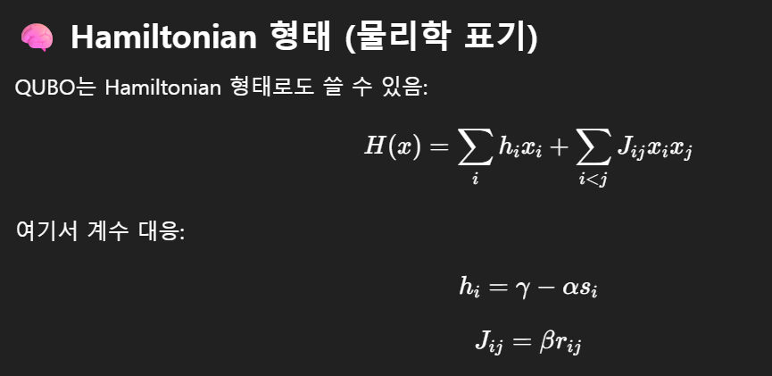
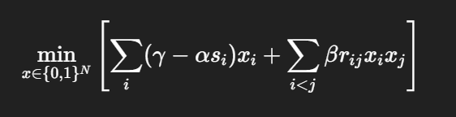

# QUBO 기반 Dataset Subset Selection 설계 문서

## 목적함수
f(x) = γΣx_i − αΣs_i x_i + βΣr_ij x_i x_j  
f(x) = 선택비용 - 데이터 중요도 + 중복성  


## 해밀토니안


## 최종목적함수


## 중요도 s_i
kNN 거리 기반 정의  
min-max 정규화  
```python
from sklearn.preprocessing import MinMaxScaler

scaler = MinMaxScaler()
X_scaled = scaler.fit_transform(X)
```


## 유사도 r_ij
kNN 이웃일 때만 cosine similarity  
  
KNN은 비대칭 특성이므로 i→j 관계 또는 j→i 관계 있으면 similarity 계산
아니면 0인 식으로 대칭  
kNN은 원래 이렇게 동작함:

i의 이웃 j
≠
j의 이웃 i  

rᵢⱼ = (1 + cosine(xᵢ, xⱼ)) / 2  
```python
from sklearn.preprocessing import StandardScaler

X_scaled = StandardScaler().fit_transform(X) // feature간 정규화 필요
R = cosine_similarity(X_scaled)
```
​
## 선택비용 γ
γ를 일단 s_i의 median 값으로 설정하고,  
sweep을 통해 최적의 γ 찾음  


## QUBO 변환
Diagonal:
Q_ii = γ − α s_i

Off-diagonal:
Q_ij = β r_ij  

  
## 파이프라인
데이터 → s → R → Q → solver → subset
